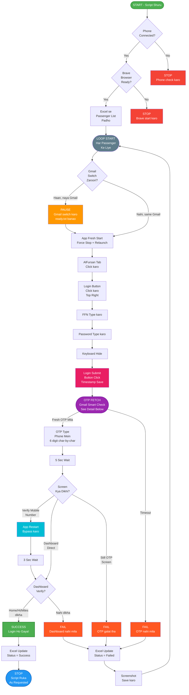
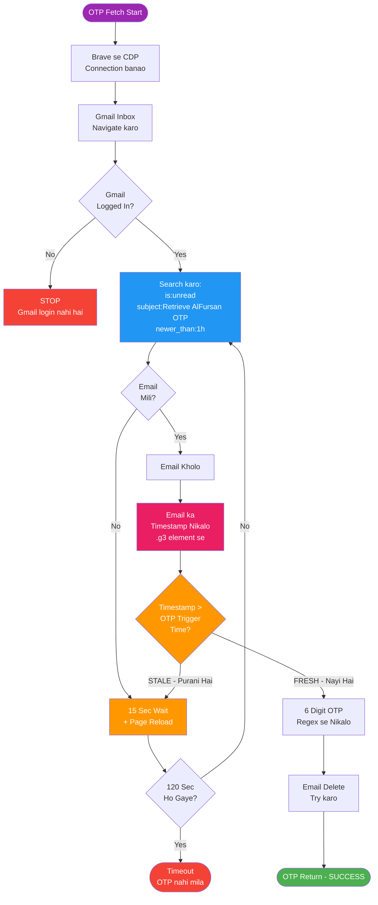
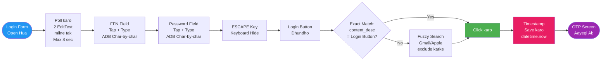
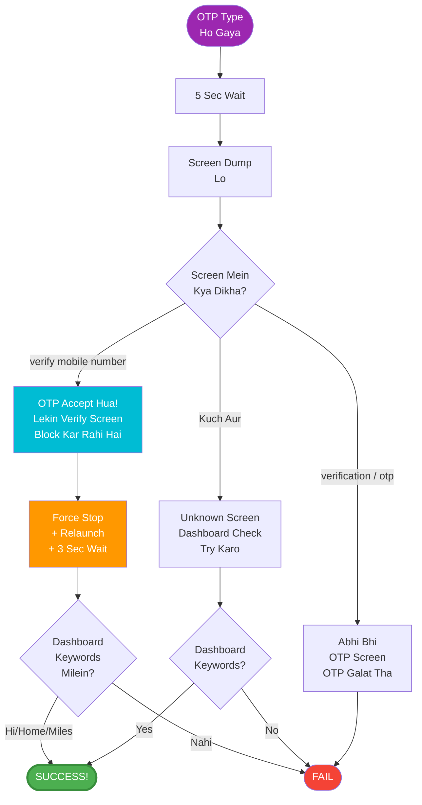

# SAUDIA AUTOMATION — LIVE WORKING FLOW

> **Ye document kya hai?**
> Ye ek "bridge" hai — aap (human) aur AI ke beech.
> Aap simple language mein apna goal likhein, AI isko padhke seedha sahi jagah code update karega.
> Har code change ke baad ye document bhi update hoga — hamesha sync mein rahega.

---

## MASTER FLOW (Poora Process — Ek Nazar Mein)

---

## OTP FETCH — Detail Flow (S8 Ka Andar)

---

## LOGIN FORM — Detail Flow (S5-S7 Ka Andar)

---

## VERIFY BYPASS — Detail Flow (S10-S12 Ka Andar)

---

## Step - Code Mapping (Quick Reference)

| Step | Kya Hota Hai | Code File | Line Numbers |
|------|-------------|-----------|--------------|
| S0 | Phone + Browser health check | main.py | 67-81 |
| S1 | Excel se passenger list | main.py | 83-95 |
| S2 | Gmail switch + ready.txt wait | main.py | 113-125 |
| S3 | App restart (force stop + launch) | phone_control.py | 179-188 |
| S4 | AlFursan tab find + click | phone_control.py | 212-231 |
| S5 | Login button find + click | phone_control.py | 233-251 |
| S6 | FFN + Password type | phone_control.py | 253-280 |
| S7 | Login submit + timestamp save | phone_control.py | 282-329 |
| S8 | OTP fetch (Gmail smart check) | gmail_otp.py | 57-210 |
| S9 | OTP type in phone | phone_control.py | 134-165 |
| S10 | Screen check after OTP | main.py | 149-186 |
| S11 | App restart (verify bypass) | main.py | 153-158 |
| S12 | Dashboard verify | main.py | 39-60 |
| S13 | Excel update + stop | main.py | 162-168 |
| S14 | Error handler + screenshot | main.py | 191-199 |

---

## Change Request Guide

Aapko code ki koi tension nahi leni hai. Bas neeche diye format mein apni baat likhein:

**Type 1:** Step ke beech kuch add karna hai
> "S7 ke baad ek popup aata hai, usko dismiss karna hai"

**Type 2:** Goal batana hai
> "Goal: Dashboard se miles ka number chahiye Excel mein"

**Type 3:** Existing step modify karna hai
> "S6 mein password ke baad 1 second wait kaafi hai"

---

## Sync Rule

Ye document hamesha code ke saath sync mein rahega.
Har approved code change ke baad:
1. Code update hoga
2. FLOW.md ka relevant step update hoga
3. Mermaid graphs update honge
4. Step - Code mapping table update hogi

---

*Last Updated: 2026-07-05 | Version: 2.1 | Status: LIVE and VERIFIED*
