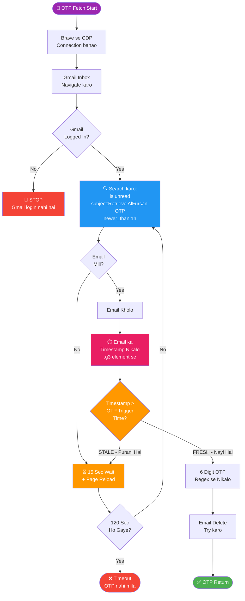

# SAUDIA AUTOMATION — LIVE WORKING FLOW

> **Ye document kya hai?**
> Ye ek "bridge" hai — aap (human) aur AI ke beech.
> Aap simple language mein apna goal likhein, AI isko padhke seedha sahi jagah code update karega.
> Har code change ke baad ye document bhi update hoga — hamesha sync mein rahega.

---

## MASTER FLOW (Poora Process — Ek Nazar Mein)

```mermaid
flowchart TD
    START(["🟢 START<br/>Script Shuru"])
    START --> H1{"Phone<br/>Connected?"}
    H1 -->|Yes| H2{"Brave<br/>Browser<br/>Ready?"}
    H1 -->|No| ERR1["🔴 STOP<br/>Phone check karo"]
    H2 -->|Yes| S1["📋 Excel se<br/>Passenger List<br/>Padho"]
    H2 -->|No| ERR2["🔴 STOP<br/>Brave start karo"]

    S1 --> LOOP_START(["🔄 LOOP START<br/>Har Passenger<br/>Ke Liye"])

    LOOP_START --> G1{"Gmail<br/>Switch<br/>Zaroori?"}
    G1 -->|Haan, naya Gmail| S2["⏸️ PAUSE<br/>Gmail switch karo<br/>ready.txt banao"]
    G1 -->|Nahi, same Gmail| S3

    S2 --> S3["📱 App Fresh Start<br/>Force Stop + Relaunch"]

    S3 --> S4["👆 AlFursan Tab<br/>Click karo"]
    S4 --> S5["👆 Login Button<br/>Click karo<br/>Top Right"]

    S5 --> S6["⌨️ FFN Type karo"]
    S6 --> S6B["⌨️ Password Type karo"]
    S6B --> S6C["⌨️ Keyboard Hide"]

    S6C --> S7["👆 Login Submit<br/>Button Click<br/>⏱️ Timestamp Save"]

    S7 --> S8(["📧 OTP FETCH<br/>Gmail Smart Check<br/>See Detail Below"])

    S8 -->|Fresh OTP Mila| S9["⌨️ OTP Type<br/>Phone Mein<br/>6 digit char-by-char"]
    S8 -->|Timeout| FAIL1["❌ FAIL<br/>OTP nahi mila"]

    S9 --> WAIT["⏳ 5 Sec Wait"]
    WAIT --> S10{"Screen<br/>Kya Dikhi?"}

    S10 -->|Verify Mobile<br/>Number| S11["📱 App Restart<br/>Bypass karo"]
    S10 -->|Dashboard<br/>Direct| S12
    S10 -->|Still OTP<br/>Screen| FAIL2["❌ FAIL<br/>OTP galat tha"]

SAUDIA AUTOMATION — LIVE WORKING FLOW
Ye document kya hai? Ye ek "bridge" hai — aap (human) aur AI ke beech. Aap simple language mein apna goal likhein, AI isko padhke seedha sahi jagah code update karega. Har code change ke baad ye document bhi update hoga — hamesha sync mein rahega.

MASTER FLOW (Poora Process — Ek Nazar Mein)
Yes

No

Yes

No

Haan, naya Gmail

Nahi, same Gmail

Fresh OTP Mila

Timeout

Verify Mobile
Number

Dashboard
Direct

Still OTP
Screen

Home/Hi/Miles
dikha

Nahi dikha

🟢 START
Script Shuru

Phone
Connected?

Brave
Browser
Ready?

🔴 STOP
Phone check karo

📋 Excel se
Passenger List
Padho

🔴 STOP
Brave start karo

🔄 LOOP START
Har Passenger
Ke Liye

Gmail
Switch
Zaroori?

⏸️ PAUSE
Gmail switch karo
ready.txt banao

📱 App Fresh Start
Force Stop + Relaunch

👆 AlFursan Tab
Click karo

👆 Login Button
Click karo
Top Right

⌨️ FFN Type karo

⌨️ Password Type karo

⌨️ Keyboard Hide

👆 Login Submit
Button Click
⏱️ Timestamp Save

📧 OTP FETCH
Gmail Smart Check
See Detail Below

⌨️ OTP Type
Phone Mein
6 digit char-by-char

❌ FAIL
OTP nahi mila

⏳ 5 Sec Wait

Screen
Kya Dikhi?

📱 App Restart
Bypass karo

Dashboard
Verify?

❌ FAIL
OTP galat tha

⏳ 3 Sec Wait

✅ SUCCESS
Login Ho Gaya!

❌ FAIL
Dashboard nahi mila

📝 Excel Update
Status = Success

🔵 STOP
Script Ruka
As Requested

📝 Excel Update
Status = Failed

📸 Screenshot
Save karo


OTP FETCH — Detail Flow (S8 Ka Andar)
No

Yes

No

Yes

FRESH - Nayi Hai

STALE - Purani Hai

No

Yes

📧 OTP Fetch Start

Brave se CDP
Connection banao

Gmail Inbox
Navigate karo

Gmail
Logged In?

🔴 STOP
Gmail login nahi hai

🔍 Search karo:
is:unread
subject:Retrieve AlFursan OTP
newer_than:1h

Email
Mili?

⏳ 15 Sec Wait
+ Page Reload

Email Kholo

⏱️ Email ka
Timestamp Nikalo
.g3 element se

Timestamp >
OTP Trigger
Time?

6 Digit OTP
Regex se Nikalo

Email Delete
Try karo

✅ OTP Return

120 Sec
Ho Gaye?

❌ Timeout
OTP nahi mila


LOGIN FORM — Detail Flow (S5-S7 Ka Andar)
Yes

No

Login Form
Open Hua

Poll karo
2 EditText
milne tak
Max 8 sec

FFN Field
Tap + Type
ADB Char-by-char

Password Field
Tap + Type
ADB Char-by-char

ESCAPE Key
Keyboard Hide

Login Button
Dhundho

Exact Match:
content_desc
= Login Button?

Click karo

Fuzzy Search
Gmail/Apple
exclude karke

⏱️ Timestamp
Save karo
datetime.now()

OTP Screen
Aayegi Ab


VERIFY BYPASS — Detail Flow (S10-S12 Ka Andar)
verify mobile number

verification / otp

Kuch Aur

Hi/Home/Miles

Nahi

Yes

No

OTP Type
Ho Gaya

⏳ 5 Sec Wait

Screen Dump
Lo

Screen Mein
Kya Dikha?

✅ OTP Accept Hua!
Lekin Verify Screen
Block Kar Rahi Hai

❌ Abhi Bhi
OTP Screen
OTP Galat Tha

🤔 Unknown Screen
Dashboard Check
Try Karo

📱 Force Stop
+ Relaunch
+ 3 Sec Wait

Dashboard
Keywords
Milein?

✅ SUCCESS!

❌ FAIL

Dashboard
Keywords?


Step ↔ Code Mapping (Quick Reference)
Step	Kya Hota Hai	Code File	Line Numbers
S0	Phone + Browser health check	[main.py](file:///C:/Users/ashus/SaudiaAutomation/scripts/main.py#L67-L81)	67-81
S1	Excel se passenger list	[main.py](file:///C:/Users/ashus/SaudiaAutomation/scripts/main.py#L83-L95)	83-95
S2	Gmail switch + ready.txt wait	[main.py](file:///C:/Users/ashus/SaudiaAutomation/scripts/main.py#L113-L125)	113-125
S3	App restart (force stop + launch)	[phone_control.py](file:///C:/Users/ashus/SaudiaAutomation/scripts/phone_control.py#L179-L188)	179-188
S4	AlFursan tab find + click	[phone_control.py](file:///C:/Users/ashus/SaudiaAutomation/scripts/phone_control.py#L212-L231)	212-231
S5	Login button find + click	[phone_control.py](file:///C:/Users/ashus/SaudiaAutomation/scripts/phone_control.py#L233-L251)	233-251
S6	FFN + Password type	[phone_control.py](file:///C:/Users/ashus/SaudiaAutomation/scripts/phone_control.py#L253-L280)	253-280
S7	Login submit + timestamp save	[phone_control.py](file:///C:/Users/ashus/SaudiaAutomation/scripts/phone_control.py#L282-L329)	282-329
S8	OTP fetch (Gmail smart check)	[gmail_otp.py](file:///C:/Users/ashus/SaudiaAutomation/scripts/gmail_otp.py#L57-L210)	57-210
S9	OTP type in phone	[phone_control.py](file:///C:/Users/ashus/SaudiaAutomation/scripts/phone_control.py#L134-L165)	134-165
S10	Screen check after OTP	[main.py](file:///C:/Users/ashus/SaudiaAutomation/scripts/main.py#L149-L186)	149-186
S11	App restart (verify bypass)	[main.py](file:///C:/Users/ashus/SaudiaAutomation/scripts/main.py#L153-L158)	153-158
S12	Dashboard verify	[main.py](file:///C:/Users/ashus/SaudiaAutomation/scripts/main.py#L39-L60)	39-60
S13	Excel update + stop	[main.py](file:///C:/Users/ashus/SaudiaAutomation/scripts/main.py#L162-L168)	162-168
S14	Error handler + screenshot	[main.py](file:///C:/Users/ashus/SaudiaAutomation/scripts/main.py#L191-L199)	191-199
Change Request Guide
Aapko code ki koi tension nahi leni hai. Bas neeche diye format mein apni baat likhein:

Type 1: Step ke beech kuch add karna hai
"S7 ke baad ek popup aata hai 'Terms & Conditions', usko dismiss karna hai"
Type 2: Goal batana hai
"Goal: Dashboard se miles ka number chahiye Excel mein"
Type 3: Existing step modify karna hai
"S6 mein password type karne ke baad 1 second wait kaafi hai, 2 nahi chahiye"
Impact Analysis (Har change se pehle main bataunga):
CHANGE:   [Kya change hua]
STEP:     [S__ → S__]
FILE:     [Kaunsi file, line]
RISK:     [Low / Medium / High]
EFFECTS:  [Aur kya affect hoga]
Sync Rule
[!IMPORTANT] Ye document hamesha code ke saath sync mein rahega. Har approved code change ke baad:

Code update hoga
FLOW.md ka relevant step update hoga
Mermaid graphs update honge
Step ↔ Code mapping table update hogi
Last Updated: 2026-07-05 | Version: 2.0 | Status: LIVE & VERIFIED    S11 --> WAIT2["⏳ 3 Sec Wait"]
    WAIT2 --> S12{"Dashboard<br/>Verify?"}

    S12 -->|Home/Hi/Miles<br/>dikha| SUCCESS["✅ SUCCESS<br/>Login Ho Gaya!"]
    S12 -->|Nahi dikha| FAIL3["❌ FAIL<br/>Dashboard nahi mila"]

    SUCCESS --> S13["📝 Excel Update<br/>Status = Success"]
    S13 --> STOP_OK(["🔵 STOP<br/>Script Ruka<br/>As Requested"])

    FAIL1 --> FAIL_HANDLER
    FAIL2 --> FAIL_HANDLER
    FAIL3 --> FAIL_HANDLER["📝 Excel Update<br/>Status = Failed"]
    FAIL_HANDLER --> S14["📸 Screenshot<br/>Save karo"]
    S14 --> LOOP_START

    style START fill:#4CAF50,color:white,stroke:#388E3C,stroke-width:2px
    style STOP_OK fill:#2196F3,color:white,stroke:#1565C0,stroke-width:2px
    style ERR1 fill:#f44336,color:white
    style ERR2 fill:#f44336,color:white
    style FAIL1 fill:#FF5722,color:white
    style FAIL2 fill:#FF5722,color:white
    style FAIL3 fill:#FF5722,color:white
    style SUCCESS fill:#4CAF50,color:white,stroke:#388E3C,stroke-width:3px
    style S8 fill:#9C27B0,color:white,stroke:#7B1FA2,stroke-width:2px
    style S2 fill:#FF9800,color:white
    style S7 fill:#E91E63,color:white
    style S11 fill:#00BCD4,color:white
    style LOOP_START fill:#607D8B,color:white
```

---

## OTP FETCH — Detail Flow (S8 Ka Andar)



---

## LOGIN FORM — Detail Flow (S5-S7 Ka Andar)


---

## VERIFY BYPASS — Detail Flow (S10-S12 Ka Andar)


---

## Step ↔ Code Mapping (Quick Reference)

| Step | Kya Hota Hai | Code File | Line Numbers |
|------|-------------|-----------|--------------|
| S0 | Phone + Browser health check | [main.py](file:///C:/Users/ashus/SaudiaAutomation/scripts/main.py#L67-L81) | 67-81 |
| S1 | Excel se passenger list | [main.py](file:///C:/Users/ashus/SaudiaAutomation/scripts/main.py#L83-L95) | 83-95 |
| S2 | Gmail switch + ready.txt wait | [main.py](file:///C:/Users/ashus/SaudiaAutomation/scripts/main.py#L113-L125) | 113-125 |
| S3 | App restart (force stop + launch) | [phone_control.py](file:///C:/Users/ashus/SaudiaAutomation/scripts/phone_control.py#L179-L188) | 179-188 |
| S4 | AlFursan tab find + click | [phone_control.py](file:///C:/Users/ashus/SaudiaAutomation/scripts/phone_control.py#L212-L231) | 212-231 |
| S5 | Login button find + click | [phone_control.py](file:///C:/Users/ashus/SaudiaAutomation/scripts/phone_control.py#L233-L251) | 233-251 |
| S6 | FFN + Password type | [phone_control.py](file:///C:/Users/ashus/SaudiaAutomation/scripts/phone_control.py#L253-L280) | 253-280 |
| S7 | Login submit + timestamp save | [phone_control.py](file:///C:/Users/ashus/SaudiaAutomation/scripts/phone_control.py#L282-L329) | 282-329 |
| S8 | OTP fetch (Gmail smart check) | [gmail_otp.py](file:///C:/Users/ashus/SaudiaAutomation/scripts/gmail_otp.py#L57-L210) | 57-210 |
| S9 | OTP type in phone | [phone_control.py](file:///C:/Users/ashus/SaudiaAutomation/scripts/phone_control.py#L134-L165) | 134-165 |
| S10 | Screen check after OTP | [main.py](file:///C:/Users/ashus/SaudiaAutomation/scripts/main.py#L149-L186) | 149-186 |
| S11 | App restart (verify bypass) | [main.py](file:///C:/Users/ashus/SaudiaAutomation/scripts/main.py#L153-L158) | 153-158 |
| S12 | Dashboard verify | [main.py](file:///C:/Users/ashus/SaudiaAutomation/scripts/main.py#L39-L60) | 39-60 |
| S13 | Excel update + stop | [main.py](file:///C:/Users/ashus/SaudiaAutomation/scripts/main.py#L162-L168) | 162-168 |
| S14 | Error handler + screenshot | [main.py](file:///C:/Users/ashus/SaudiaAutomation/scripts/main.py#L191-L199) | 191-199 |

---

## Change Request Guide

> **Aapko code ki koi tension nahi leni hai.** Bas neeche diye format mein apni baat likhein:

### Type 1: Step ke beech kuch add karna hai
```
"S7 ke baad ek popup aata hai 'Terms & Conditions', usko dismiss karna hai"
```

### Type 2: Goal batana hai
```
"Goal: Dashboard se miles ka number chahiye Excel mein"
```

### Type 3: Existing step modify karna hai
```
"S6 mein password type karne ke baad 1 second wait kaafi hai, 2 nahi chahiye"
```

### Impact Analysis (Har change se pehle main bataunga):
```
CHANGE:   [Kya change hua]
STEP:     [S__ → S__]
FILE:     [Kaunsi file, line]
RISK:     [Low / Medium / High]
EFFECTS:  [Aur kya affect hoga]
```

---

## Sync Rule

> [!IMPORTANT]
> **Ye document hamesha code ke saath sync mein rahega.**
> Har approved code change ke baad:
> 1. Code update hoga
> 2. FLOW.md ka relevant step update hoga
> 3. Mermaid graphs update honge
> 4. Step ↔ Code mapping table update hogi

---

*Last Updated: 2026-07-05 | Version: 2.0 | Status: LIVE & VERIFIED*
